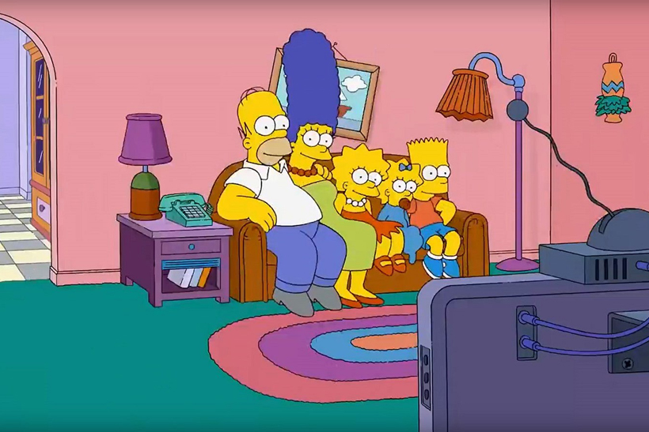
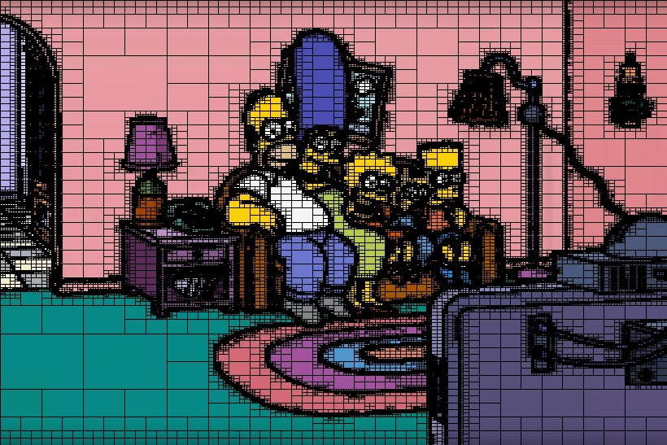
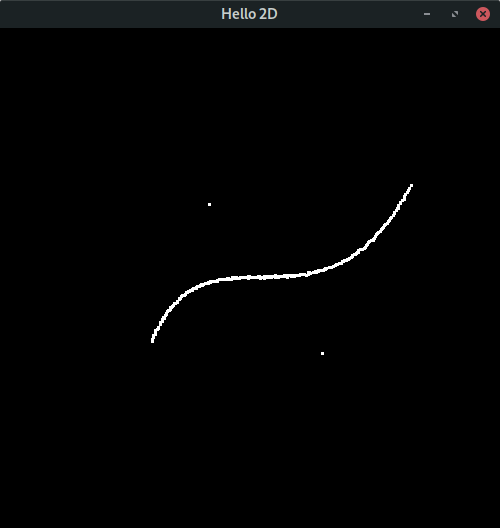
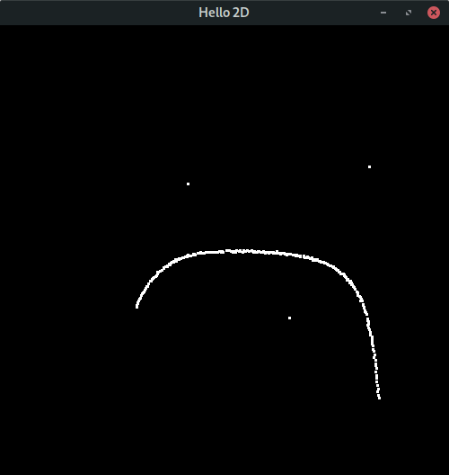

# Prácticas de Laboratorio de Gráfica
    Practicas de Laboratorio del curso de Computación Grafica
## Lab1-2D
    - Graficado de líneas en 2D
    - Graficado de Polígonos en 2D
    - Traslación, escala y rotación de polígonos
## Lab1-3D
    - Graficado de líneas en 3D
## Lab4-QuadTree


## Lab4-Bezier



****
*Nota: Para correr cada laboratorio ejecutar ```make```.